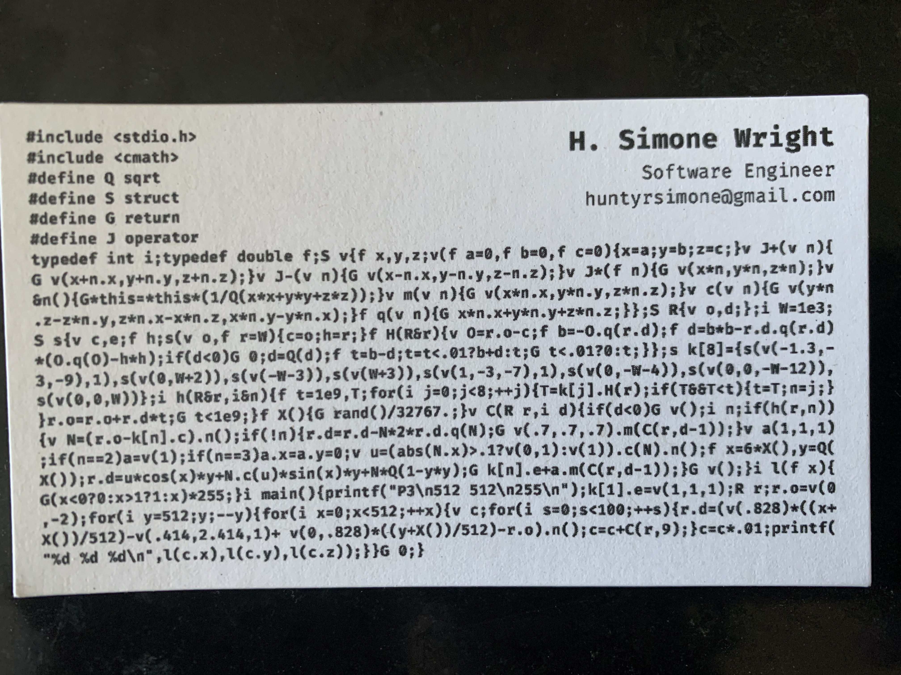
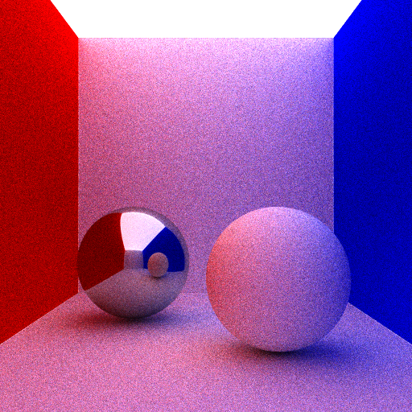

# CSE 167 HW4 Extra Credit

This is my extra credit submission for the ray tracer assignment.

## Path Tracer Business Card

I wanted to make a path tracer because I wanted to see global illumination in my scenes. Then I thought it would be neat to make a business card out of it (~~I deeply regret it~~). After many many hours and lots of hair pulling, I had successfully condensed my initial path tracer code into 1,444 characters and printed it on business cards. I got the inspiration to make a pocket-sized path tracer from Kevin Beason's [*smallPT*](https://www.kevinbeason.com/smallpt/). His implementation also helped me understand the algorithm, so I highly recommend checking out his article.



### Implementation

This implementation uses Monte Carlo integration to calculate the directions of secondary rays when they hit a lambertian (diffuse) surface. I was only able to make one shape, and it had to be a sphere since it was the simplest primitive and required the least amount of code. The walls, floor, and ceiling are gigantic spheres and the ceiling is the emmiter. The contents of the Cornell Box are two spheres, one is metal and the other is lambertian. I chose these materials because I thought they would better represent the abilities of the path tracer.

Here is the code. You can run it with `./card > card.ppm` to save the output in a `.ppm` file and view the final image with [this ppm viewer website.](https://www.cs.rhodes.edu/welshc/COMP141_F16/ppmReader.html) Be warned, it is slow. There is also antialiasing with a sample size of 100. You can change that value if you'd like, as well as the size of the image. 
```
#include <stdio.h>
#include <cmath>
#define Q sqrt
#define S struct
#define G return
#define J operator
typedef int i;typedef double f;S v{f x,y,z;v(f a=0,f b=0,f c=0){x=a;y=b;z=c;}v J+(v n){
G v(x+n.x,y+n.y,z+n.z);}v J-(v n){G v(x-n.x,y-n.y,z-n.z);}v J*(f n){G v(x*n,y*n,z*n);}v
&n(){G*this=*this*(1/Q(x*x+y*y+z*z));}v m(v n){G v(x*n.x,y*n.y,z*n.z);}v c(v n){G v(y*n
.z-z*n.y,z*n.x-x*n.z,x*n.y-y*n.x);}f q(v n){G x*n.x+y*n.y+z*n.z;}};S R{v o,d;};i W=1e3;
S s{v c,e;f h;s(v o,f r=W){c=o;h=r;}f H(R&r){v O=r.o-c;f b=-O.q(r.d);f d=b*b-r.d.q(r.d)
*(O.q(O)-h*h);if(d<0)G 0;d=Q(d);f t=b-d;t=t<.01?b+d:t;G t<.01?0:t;}};s k[8]={s(v(-1.3,-
3,-9),1),s(v(0,W+2)),s(v(-W-3)),s(v(W+3)),s(v(1,-3,-7),1),s(v(0,-W-4)),s(v(0,0,-W-12)),
s(v(0,0,W))};i h(R&r,i&n){f t=1e9,T;for(i j=0;j<8;++j){T=k[j].H(r);if(T&&T<t){t=T;n=j;}
}r.o=r.o+r.d*t;G t<1e9;}f X(){G rand()/32767.;}v C(R r,i d){if(d<0)G v();i n;if(h(r,n))
{v N=(r.o-k[n].c).n();if(!n){r.d=r.d-N*2*r.d.q(N);G v(.7,.7,.7).m(C(r,d-1));}v a(1,1,1)
;if(n==2)a=v(1);if(n==3)a.x=a.y=0;v u=(abs(N.x)>.1?v(0,1):v(1)).c(N).n();f x=6*X(),y=Q(
X());r.d=u*cos(x)*y+N.c(u)*sin(x)*y+N*Q(1-y*y);G k[n].e+a.m(C(r,d-1));}G v();}i l(f x){
G(x<0?0:x>1?1:x)*255;}i main(){printf("P3\n512 512\n255\n");k[1].e=v(1,1,1);R r;r.o=v(0
,-2);for(i y=512;y;--y){for(i x=0;x<512;++x){v c;for(i s=0;s<100;++s){r.d=(v(.828)*((x+
X())/512)-v(.414,2.414,1)+v(0,.828)*((y+X())/512)-r.o).n();c=c+C(r,9);}c=c*.01;printf(
"%d %d %d\n",l(c.x),l(c.y),l(c.z));}}G 0;}
```

Here is the expanded function `C` that finds and returns the color of each pixel. It is a recursive function that computes the radiance of a point `x` given by a viewing direction.
```
vec3 C(Ray r, int d)
{
    if(d < 0)
        return vec3();
    int n;
    if(hit(r, n))
    {
        vec3 N = (r.origin - objects[n].center).normalize();
        if(!n){
            r.direction = r.direction - N*2*r.direction.dot(N);
            return vec3(.7,.7,.7).multiply( C(r, d-1) );
        }
        vec3 a(1,1,1);
        if (n == 2) a = vec3(1);
        if (n == 3) a.x = a.y = 0;
        vec3 u = (abs(N.x) > .1 ? vec3(0,1) : vec3(1)).cross(N).normalize();
        double x = 6 * random(), y = sqrt(random()); // 2 * PI rounds to 6
        r.direction = u*cos(x)*y + N.cross(u)*sin(x)*y + N*sqrt(1-y*y);
        return objects[n].emission + a.multiply( C(r, d-1) );
    }
    return vec3();
}
```
The spheres are in an array and the `hit` function returns an index of the sphere `n` that has the closest intersection point. Depending on the index `n`, the function will use a color `a` to compute the final color of the pixel. If `n == 0`, the ray intersected the metal sphere, and the ray will be perfectly reflected about the surface normal `N`. If `n == 2` the ray intersected the red wall and the color `a` will be red. If `n == 3` the ray hit the blue wall and the color will be blue. If none of these are true then the color will be white and the ray will be reflected in a random direction. This will be done recursively for `d` times, then the final color will be set for that pixel.

The `hit` function is fairly simple. It just determines the closest sphere that a ray intersects with and returns the index of that sphere. In this particular scene, a ray is guaranteed to hit a sphere since the box has all 6 sides.

### Final Image


This was a fun project and it made me excited to learn more about ray tracing in CSE 168 next quarter!